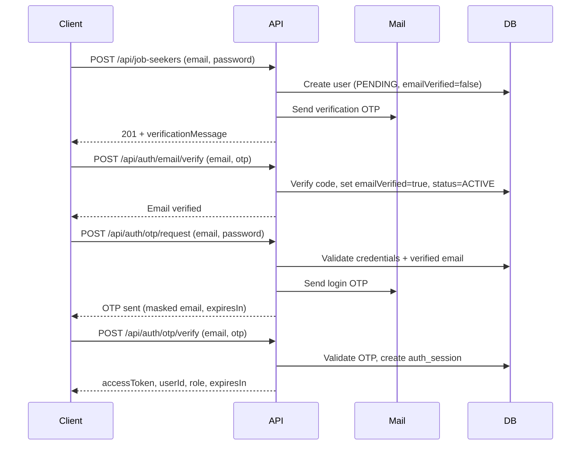

# Skytouch

Backend API for the Skytouch platform, built with Spring Boot. The application uses a domain-driven package structure where each feature area owns its controller, API models, service, and repository layers.

## Tech Stack

- Java 21
- Spring Boot 4.0.6
- Spring Data JPA
- PostgreSQL
- Flyway (database migrations)
- Springdoc OpenAPI (Swagger UI)
- Lombok
- Maven
- Podman
- Jenkins (CI/CD)

## Prerequisites

- JDK 21
- PostgreSQL (local database: `skytouch_db`)
- Git
- Podman (optional, for containerized runs)

## Getting Started

All Maven commands must be run from the `Skytouch` directory (where `pom.xml` and `mvnw.cmd` live).

```powershell
cd Skytouch
```

### Build

```powershell
.\mvnw.cmd clean install
```

Skip tests during development:

```powershell
.\mvnw.cmd clean install -DskipTests
```

### Run

```powershell
.\mvnw.cmd spring-boot:run
```

The app starts on **[http://localhost:8083](http://localhost:8083)** by default (`local` profile).

### API Documentation

Once running, open Swagger UI at:

- [http://localhost:8083/swagger-ui.html](http://localhost:8083/swagger-ui.html)

## Configuration

Secrets and environment-specific values live in a `.env` file at the project root. Config files reference them via `${VAR_NAME}` — no secrets are hardcoded in YAML.

### Setup

```powershell
cp .env.example .env
```

Edit `.env` with your local values. `.env` is gitignored; `.env.example` is the committed template.


| Variable              | Used in                                                                         |
| --------------------- | ------------------------------------------------------------------------------- |
| `PORT`                | `application.yml`, Docker                                                       |
| `DATASOURCE_URL`      | `application-local.yml`, `application-prod.yml`                                 |
| `DATASOURCE_USERNAME` | `application-local.yml`, `application-prod.yml`                                 |
| `DATASOURCE_PASSWORD` | `application-local.yml`, `application-prod.yml`, Docker Postgres                |
| `POSTGRES_DB`         | `docker-compose.yml`                                                            |
| `POSTGRES_USER`       | `docker-compose.yml`                                                            |
| `POSTGRES_PASSWORD`   | `docker-compose.yml`                                                            |
| `MAIL_USERNAME`       | `application-local.yml`, `application-prod.yml` (OTP email delivery)            |
| `MAIL_PASSWORD`       | `application-local.yml`, `application-prod.yml` (OTP email delivery)            |
| `APP_EMAIL_FROM`      | `application-local.yml`, `application-prod.yml` (sender address for OTP emails) |
| `APP_FRONTEND_URL`    | `application-local.yml`, `application-prod.yml`                                 |
| `JWT_SECRET`          | `docker-compose.yml` only (legacy; auth uses DB-backed session tokens, not JWT) |


Spring Boot loads `.env` automatically via `spring.config.import` in `application.yml`.


| Profile | File                    | Purpose                            |
| ------- | ----------------------- | ---------------------------------- |
| `local` | `application-local.yml` | Local development (default)        |
| `prod`  | `application-prod.yml`  | Production (env-based config)      |
| `test`  | `application-test.yml`  | CI/tests (PostgreSQL via env vars) |


Base settings live in `application.yml`. The active profile is `local` unless overridden:

```powershell
.\mvnw.cmd spring-boot:run -Dspring-boot.run.arguments="--spring.profiles.active=prod"
```

### Database

Local PostgreSQL connection (values in `.env`):

- **URL:** `${DATASOURCE_URL}` → `jdbc:postgresql://localhost:5432/skytouch_db`
- **Migrations:** `src/main/resources/db/migration/`

Flyway runs automatically on startup and applies pending migrations.

## Docker

### Run with Podman Compose

Starts PostgreSQL and the app together:

```powershell
podman compose up --build
```

App: **[http://localhost:8083](http://localhost:8083)**

Stop containers:

```powershell
podman compose down
```

### Build image only

```powershell
podman build -t skytouch-app .
```

Run the image (requires a running PostgreSQL instance):

```powershell
podman run -p 8083:5000 `
  -e SPRING_PROFILES_ACTIVE=prod `
  -e DATASOURCE_URL=jdbc:postgresql://host.containers.internal:5432/skytouch_db `
  -e DATASOURCE_USERNAME=postgres `
  -e DATASOURCE_PASSWORD=your-password `
  -e JWT_SECRET=your-jwt-secret `
  -e MAIL_USERNAME=noreply@example.com `
  -e MAIL_PASSWORD=changeme `
  -e APP_FRONTEND_URL=http://localhost:4174 `
  skytouch-app
```

## CI/CD (Jenkins + Podman)

### Team setup (simplest)

**One Jenkins server for the whole team** — not on every laptop.


| Who                             | Needs Jenkins? | Needs Podman?        |
| ------------------------------- | -------------- | -------------------- |
| Each developer                  | No             | Yes (local app only) |
| One shared server / teammate PC | Yes            | Yes                  |


Everyone else: `git push` → Jenkins on the shared server runs `Jenkinsfile`.

### Run Jenkins locally (test the pipeline)

From the `Skytouch` folder:

```powershell
cd C:\Users\Staff\Downloads\skytouch_project\Skytouch
copy .env.jenkins.example .env.jenkins
# Edit .env.jenkins — set POSTGRES_PASSWORD and JWT_SECRET (CI-only values)
podman compose -f docker-compose.jenkins.yml up --build -d
```

> `.env.jenkins` is gitignored. Never commit real credentials. Use disposable values for local CI only.

Open **[http://localhost:8080](http://localhost:8080)**

**First-time setup:**

1. Get the initial admin password:
  ```powershell
   podman exec skytouch-jenkins cat /var/jenkins_home/secrets/initialAdminPassword
  ```
2. Install suggested plugins
3. Create an admin user
4. **New Item** → **Pipeline** → name it `skytouch`
5. **Pipeline** → Definition: *Pipeline script from SCM*
6. SCM: **Git** → `https://github.com/ochogwuprince92/Skytouch.git`
7. Script Path: `Jenkinsfile`
8. Save → **Build Now**

Stop Jenkins:

```powershell
podman compose -f docker-compose.jenkins.yml down
```

> **Note:** Skytouch app uses port **8083**, Jenkins uses **8080** — no conflict.

### Pipeline stages (`Jenkinsfile`)


| Stage       | Description                                                        |
| ----------- | ------------------------------------------------------------------ |
| Checkout    | Pulls source code                                                  |
| Test        | `./mvnw clean test` (uses `postgres-ci` + env from `.env.jenkins`) |
| Package     | Builds JAR                                                         |
| Build Image | `podman build`                                                     |
| Push Image  | `main` / `dev` / `v`* tags only                                    |


### Registry push (optional)

Only needed when pushing images. In Jenkins → **Credentials** → add `docker-registry-credentials` (username/password).


| Variable            | Example             |
| ------------------- | ------------------- |
| `DOCKER_REGISTRY`   | `docker.io`         |
| `DOCKER_IMAGE_NAME` | `your-org/skytouch` |


### Required environment variables (production)


| Variable              | Description                                                      |
| --------------------- | ---------------------------------------------------------------- |
| `DATASOURCE_URL`      | PostgreSQL JDBC URL                                              |
| `DATASOURCE_USERNAME` | Database username                                                |
| `DATASOURCE_PASSWORD` | Database password                                                |
| `MAIL_USERNAME`       | SMTP username (required for OTP login)                           |
| `MAIL_PASSWORD`       | SMTP password (required for OTP login)                           |
| `APP_EMAIL_FROM`      | Sender address for OTP emails                                    |
| `APP_FRONTEND_URL`    | Frontend base URL                                                |
| `PORT`                | Server port (default: `5000` in prod)                            |
| `JWT_SECRET`          | Legacy Docker compose variable; not used by current session auth |


## Project Structure

```
src/main/java/com/backend/Skytouch/
├── SkytouchApplication.java
├── authentication/          # Auth domain (OTP login, sessions, Spring Security)
│   ├── controller/
│   ├── apimodel/
│   ├── config/
│   ├── entity/
│   ├── security/
│   ├── service/
│   └── repository/
├── jobseeker/               # Job seeker domain
│   ├── controller/
│   ├── apimodel/
│   ├── service/
│   └── repository/
├── user/                    # Shared user/account domain
│   ├── entity/
│   └── repository/
└── common/                  # Cross-cutting concerns
    ├── config/
    ├── enums/
    ├── exception/
    ├── mapper/
    └── utils/
```

### Domain Layout

Each domain follows the same vertical slice:


| Layer        | Responsibility        |
| ------------ | --------------------- |
| `controller` | REST endpoints        |
| `apimodel`   | Request/response DTOs |
| `service`    | Business logic        |
| `repository` | Data access           |


Shared code (exceptions, mappers, utilities, enums) lives under `common/`. The `user` domain holds the core `Users` entity used across roles.

## Authentication

Skytouch uses **password + email OTP** for login and **database-backed session tokens** for API access. Spring Security is enabled with a stateless filter chain: each request is authenticated via a `Bearer` token that maps to a row in `auth_sessions`.

There is no separate signup endpoint under `/api/auth`. Registration is role-specific today (job seekers only). Employer registration is not implemented yet.

### Registration (Job Seeker)

Registration and email verification are separate steps. A job seeker must verify their email before they can log in.

1. Client sends `POST /api/job-seekers` with email and password (min. 8 characters).
2. Server checks the email is not already taken, hashes the password with BCrypt, and creates a `users` row with role `JOB_SEEKER`, status `PENDING`, and `emailVerified: false`.
3. A 6-digit verification code is emailed immediately.
4. Client verifies the email with `POST /api/auth/email/verify`. On success, `emailVerified` becomes `true` and status moves from `PENDING` to `ACTIVE`.
5. Only then can the job seeker start the login flow.

```json
POST /api/job-seekers
{
  "email": "seeker@example.com",
  "password": "password123"
}
```

**Response (`201 Created`):**

```json
{
  "id": "...",
  "email": "seeker@example.com",
  "status": "PENDING",
  "emailVerified": false,
  "active": true,
  "createdAt": "...",
  "verificationMessage": "Verification code sent to s***@example.com",
  "verificationExpiresIn": 600000
}
```

### Email verification

`POST /api/auth/email/verify`


| Field   | Rules                      |
| ------- | -------------------------- |
| `email` | Required, valid email      |
| `otp`   | Required, exactly 6 digits |


**Response (`200 OK`):**

```json
{
  "message": "Email verified successfully",
  "emailVerified": true,
  "status": "ACTIVE"
}
```

If the code expires or is lost, request a new one:

`POST /api/auth/email/resend`

```json
{ "email": "seeker@example.com" }
```

Returns the same shape as other OTP-sent responses (`message`, `expiresIn`).

### Login (OTP + Session)

Login is a two-step flow available **after email verification**. Credentials are verified first, then a one-time login code is emailed before a session is created.




#### Step 1 — Request OTP

`POST /api/auth/otp/request`


| Field      | Rules                 |
| ---------- | --------------------- |
| `email`    | Required, valid email |
| `password` | Required              |


The server validates email/password (BCrypt, with automatic upgrade from legacy plain-text passwords on successful login). The account must have a verified email, and inactive or `SUSPENDED` accounts are rejected. A new 6-digit OTP is generated, stored as a BCrypt hash, and emailed via SMTP. Any previous unconsumed login OTP for that user is invalidated.

**Response (`200 OK`):**

```json
{
  "message": "OTP sent to s***@example.com",
  "expiresIn": 600000
}
```

Default OTP lifetime: **10 minutes** (`app.auth.otp.expiration-ms`). Max verification attempts: **5** per code.

#### Step 2 — Verify OTP and get session

`POST /api/auth/otp/verify`


| Field   | Rules                      |
| ------- | -------------------------- |
| `email` | Required, valid email      |
| `otp`   | Required, exactly 6 digits |


On success:

- Pending login OTP is consumed.
- A new opaque session token (UUID) is stored in `auth_sessions` (token hash only; raw token returned once to the client).

**Response (`200 OK`):**

```json
{
  "accessToken": "f47ac10b-58cc-4372-a567-0e02b2c3d479",
  "tokenType": "Bearer",
  "expiresIn": 86400000,
  "userId": "...",
  "email": "seeker@example.com",
  "role": "JOB_SEEKER"
}
```

Default session lifetime: **24 hours** (`app.auth.session.expiration-ms`).

### Using the session token

Send the token on protected requests:

```http
Authorization: Bearer <accessToken>
```

`SessionAuthenticationFilter` resolves the token to a user, loads `UserPrincipal` (including `ROLE_<role>` authorities), and populates the Spring Security context. Swagger UI supports the same scheme — use **Authorize** and paste the token from `POST /api/auth/otp/verify`.

There is no logout/revoke endpoint yet. Sessions expire automatically; the schema also supports `revoked_at` for future revocation.

### Route access


| Path                                                | Access                |
| --------------------------------------------------- | --------------------- |
| `POST /api/auth/`**                                 | Public                |
| `POST /api/job-seekers`                             | Public (registration) |
| `/swagger-ui/**`, `/v3/api-docs/**`                 | Public                |
| `GET /api/job-seekers`, `GET /api/job-seekers/{id}` | Authenticated         |
| All other `/api/**` routes                          | Authenticated         |


Unauthenticated access to protected routes returns `401` with:

```json
{
  "status": 401,
  "error": "Unauthorized",
  "message": "Authentication required",
  "timestamp": "..."
}
```

Auth-specific validation errors (e.g. invalid OTP format) return `400` from `AuthenticationExceptionHandler`. Business auth failures (wrong password, bad OTP, suspended account) return `401` via `UnauthorizedException`.

### Auth configuration

Settings in `application.yml` under `app.auth`:


| Property                         | Default                | Description                                       |
| -------------------------------- | ---------------------- | ------------------------------------------------- |
| `app.auth.email-from`            | `noreply@skytouch.com` | OTP email sender (`APP_EMAIL_FROM`)               |
| `app.auth.otp.length`            | `6`                    | OTP digit count                                   |
| `app.auth.otp.expiration-ms`     | `600000`               | OTP validity (10 min)                             |
| `app.auth.otp.max-attempts`      | `5`                    | Failed verify attempts before code is invalidated |
| `app.auth.session.expiration-ms` | `86400000`             | Session validity (24 h)                           |


OTP delivery requires working SMTP credentials (`MAIL_USERNAME`, `MAIL_PASSWORD`).

### Auth persistence


| Table           | Purpose                                                                                          |
| --------------- | ------------------------------------------------------------------------------------------------ |
| `users`         | Accounts (email, BCrypt password, role, status, `email_verified`, `active`)                      |
| `otp_codes`     | Hashed OTPs per user/purpose (`LOGIN`, `EMAIL_VERIFICATION`), attempt count, expiry, consumption |
| `auth_sessions` | Hashed session tokens, expiry, optional revocation                                               |


Migrations: `V1__create_users_table.sql`, `V2__create_otp_and_session_tables.sql`.

## API Endpoints

### Authentication


| Method | Path                     | Auth   | Description                                                        |
| ------ | ------------------------ | ------ | ------------------------------------------------------------------ |
| `POST` | `/api/auth/otp/request`  | Public | Verify credentials and email a login OTP (requires verified email) |
| `POST` | `/api/auth/otp/verify`   | Public | Verify login OTP and issue a session token                         |
| `POST` | `/api/auth/email/verify` | Public | Verify registration email with OTP                                 |
| `POST` | `/api/auth/email/resend` | Public | Resend registration verification OTP                               |


### Job Seekers


| Method | Path                    | Auth     | Description                                           |
| ------ | ----------------------- | -------- | ----------------------------------------------------- |
| `GET`  | `/api/job-seekers`      | Required | List all job seekers                                  |
| `GET`  | `/api/job-seekers/{id}` | Required | Get job seeker by ID                                  |
| `POST` | `/api/job-seekers`      | Public   | Register a new job seeker and send verification email |


### Error Responses

API errors return a consistent JSON body via `GlobalExceptionHandler`:

```json
{
  "status": 404,
  "error": "Not Found",
  "message": "Job seeker not found: ...",
  "timestamp": "2026-06-18T21:00:00"
}
```

## User Roles


| Role         | Description            |
| ------------ | ---------------------- |
| `JOB_SEEKER` | Job seeker account     |
| `EMPLOYER`   | Employer account       |
| `ADMIN`      | Platform administrator |


## Development Notes

- Use `.\mvnw.cmd` on Windows PowerShell (not `./mvnw` from the parent folder).
- If port `8083` is in use, stop the process or set `PORT` env var / `server.port` in config.
- Spring Security is enabled. Test login end-to-end with valid `MAIL_*` credentials so OTP emails can be sent.
- Local security debug logging is on in the `local` profile (`org.springframework.security: DEBUG`)

