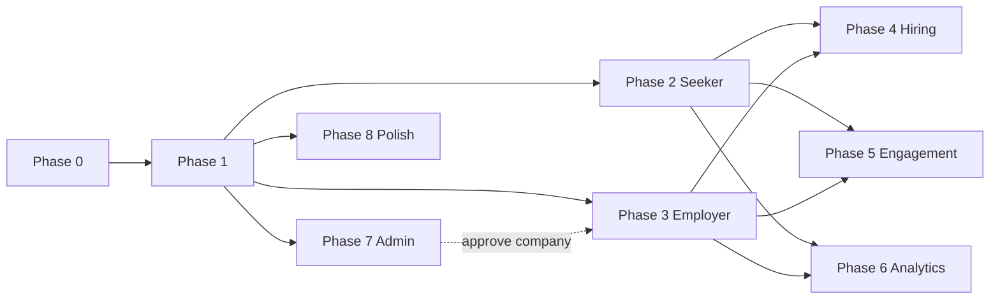

# Skytouch Frontend — Phased Delivery Plan

This document defines how to build the Skytouch frontend in phases, aligned with the existing Spring Boot REST API.

**API base (local):** `http://localhost:8083`  
**OpenAPI / Swagger:** `http://localhost:8083/swagger-ui.html`  
**Postman E2E reference:** `postman/Skytouch.postman_collection.json` (folders **01 → 04r**)

---

## Overview

| Phase | Name | Primary roles | Depends on |
|-------|------|---------------|------------|
| 0 | Foundation | All | — |
| 1 | Auth & account | All | 0 |
| 2 | Seeker core | JOB_SEEKER | 1 |
| 3 | Employer core | EMPLOYER | 1 |
| 4 | Hiring workflow | Seeker + Employer | 2, 3 |
| 5 | Engagement | Seeker (+ Employer notifications) | 2, 3 |
| 6 | Analytics & exports | Seeker + Employer | 2, 3 |
| 7 | Admin console | ADMIN | 1 |
| 8 | Account security & polish | All | 1 |

Phases **2, 3, and 7** can run in parallel after Phase 1. Phase **4** requires 2 + 3. Phase **7** (company approval) is required for full employer publish E2E when companies start as `PENDING`.



---

## Global conventions (all phases)

### Authentication

- **Register** → user is `PENDING` until email OTP verified.
- **Login** → `POST /api/auth/login` returns:
  ```json
  {
    "accessToken": "...",
    "tokenType": "Bearer",
    "expiresIn": 86400000,
    "userId": "uuid",
    "email": "...",
    "role": "JOB_SEEKER | EMPLOYER | ADMIN"
  }
  ```
- Send `Authorization: Bearer <accessToken>` on protected routes.
- **Logout:** `POST /api/auth/logout` → clear local session.
- On **401** → redirect to login. On **403** → show forbidden (wrong role).
- **Admin cannot self-register** — bootstrap only (`ADMIN_BOOTSTRAP_*` env vars).

### Pagination

List endpoints return `PageResponse`:

```json
{
  "content": [],
  "page": 0,
  "size": 20,
  "totalElements": 100,
  "totalPages": 5
}
```

Default query params: `page=0`, `size=20`.

### Errors

```json
{
  "status": 400,
  "error": "Bad Request",
  "message": "Human-readable message",
  "timestamp": "2026-..."
}
```

### Enum reference (string values)

| Enum | Values |
|------|--------|
| `UserRole` / `role` | `JOB_SEEKER`, `EMPLOYER`, `ADMIN` |
| `UserType` (register) | `JOB_SEEKER`, `EMPLOYER` |
| `UserStatus` | `PENDING`, `ACTIVE`, `SUSPENDED` |
| `CompanyStatus` | `PENDING`, `ACTIVE`, `REJECTED` |
| `JobStatus` | `DRAFT`, `ACTIVE`, `CLOSED` |
| `EmploymentType` | `FULL_TIME`, `PART_TIME`, `CONTRACT`, `INTERNSHIP` |
| `WorkMode` | `ONSITE`, `REMOTE`, `HYBRID` |
| `ApplicationStatus` | `SUBMITTED`, `REVIEWING`, `SHORTLISTED`, `INTERVIEW_SCHEDULED`, `OFFER_EXTENDED`, `OFFER_DECLINED`, `HIRED`, `REJECTED`, `WITHDRAWN` |
| `InterviewMode` | `IN_PERSON`, `VIDEO`, `PHONE` |
| `InterviewStatus` | `SCHEDULED`, `COMPLETED`, `CANCELLED`, `NO_SHOW` |
| `OfferStatus` | `PENDING`, `ACCEPTED`, `DECLINED`, `EXPIRED`, `WITHDRAWN` |
| `NotificationType` | `APPLICATION_SUBMITTED`, `NEW_APPLICATION`, `APPLICATION_STATUS_UPDATED`, `INTERVIEW_SCHEDULED`, `INTERVIEW_UPDATED`, `NEW_MESSAGE`, `COMPANY_APPROVED`, `COMPANY_REJECTED`, `ACCOUNT_SUSPENDED`, `OFFER_EXTENDED`, `OFFER_ACCEPTED`, `OFFER_DECLINED`, `HIRED`, `JOB_ALERT_MATCH`, `JOB_ALERT_DIGEST` |

For list endpoints, `PageResponse.content` is an array of the response object named in that phase (e.g. `PageResponse<JobResponse>`).

### Location reference data (public, no auth)

Used to populate country/state dropdowns in registration, KYC, company, and job forms.

| Feature | Method | Endpoint |
|---------|--------|----------|
| List countries | GET | `/api/countries?search=` |
| Country detail | GET | `/api/countries/{id}` |
| States by country | GET | `/api/countries/{id}/states` |

`GET /api/countries` (optional `search` filters by name) → array of `CountryResponse`:

```json
[
  {
    "id": 161,
    "name": "Nigeria",
    "iso2": "NG",
    "iso3": "NGA",
    "phoneCode": "+234",
    "currency": "NGN",
    "currencySymbol": "₦",
    "emoji": "🇳🇬",
    "region": "Africa",
    "subregion": "Western Africa",
    "hasStates": true
  }
]
```

`GET /api/countries/161/states` → array of `StateResponse`:

```json
[
  { "id": 288, "countryId": 161, "name": "Jigawa", "stateCode": "JI", "hasCities": true },
  { "id": 289, "countryId": 161, "name": "Enugu", "stateCode": "EN", "hasCities": true }
]
```

These return plain arrays (not `PageResponse`) since lookup lists are small. `id` is an integer (not a UUID).

### Suggested route map

| Route | Access |
|-------|--------|
| `/` | Public landing |
| `/register`, `/verify-email`, `/login`, `/forgot-password`, `/reset-password` | Public |
| `/seeker/*` | JOB_SEEKER |
| `/employer/*` | EMPLOYER |
| `/admin/*` | ADMIN |
| `/settings/account` | Authenticated (all roles) |

Post-login redirect: seeker → `/seeker/dashboard`, employer → `/employer/dashboard`, admin → `/admin/dashboard`.

---

## Phase 0 — Foundation

**Goal:** App boots, talks to the API, has auth plumbing.

### Deliverables

- React + TypeScript + Vite (or Next.js), router, env config (`VITE_API_URL`)
- API client with Bearer interceptor
- Auth store: `accessToken`, `userId`, `email`, `role`
- Error handler → toasts from `{ status, message }`
- Reusable paginated list component
- Layout shells: public + role placeholders
- Route guards: `RequireAuth`, `RequireRole`

### Exit criteria

- App runs against local API on port 8083
- 401 clears session and redirects to `/login`

---

## Phase 1 — Auth & account

**Goal:** Register, verify email, login, password recovery, logout.

### Screens & APIs

| Screen | Method | Endpoint |
|--------|--------|----------|
| Register (seeker / employer) | POST | `/api/auth/register` |
| Verify email | POST | `/api/auth/verify-email/{email}` |
| Resend OTP | POST | `/api/auth/verify-email/resend` |
| Login | POST | `/api/auth/login` |
| Forgot password | POST | `/api/auth/forgot-password` |
| Reset password | POST | `/api/auth/reset-password` |
| Logout | POST | `/api/auth/logout` |

### Payloads

**Register** — `POST /api/auth/register`

Request:

```json
{
  "userType": "JOB_SEEKER",
  "email": "seeker@example.com",
  "password": "Passw0rd!",
  "confirmPassword": "Passw0rd!",
  "firstName": "Ada",
  "middleName": "N.",
  "lastName": "Obi",
  "phone": "+2348012345678",
  "companyName": "Acme Ltd"
}
```

`userType`: `JOB_SEEKER` or `EMPLOYER` (accepts alias `role`). `password` min 8 chars, must equal `confirmPassword`. `phone` matches `^\+?[0-9]{10,15}$`. `companyName` only used when `userType=EMPLOYER` (optional at signup).

Response `201 Created`:

```json
{
  "id": "3f1c...uuid",
  "email": "seeker@example.com",
  "role": "JOB_SEEKER",
  "status": "PENDING",
  "emailVerified": false,
  "active": true,
  "createdAt": "2026-07-02T09:15:00",
  "verificationMessage": "Verification code sent to your email",
  "verificationExpiresIn": 600000
}
```

**Verify email** — `POST /api/auth/verify-email/{email}`

Request:

```json
{ "otp": "123456" }
```

`otp` must be exactly 6 digits. Response `200 OK`:

```json
{
  "message": "Email verified successfully",
  "emailVerified": true,
  "status": "ACTIVE"
}
```

**Resend OTP** — `POST /api/auth/verify-email/resend`

Request:

```json
{ "email": "seeker@example.com" }
```

Response `200 OK`:

```json
{ "message": "Verification code sent", "expiresIn": 600000 }
```

**Login** — `POST /api/auth/login`

Request:

```json
{ "email": "seeker@example.com", "password": "Passw0rd!" }
```

Response `200 OK`:

```json
{
  "accessToken": "eyJhbGciOiJIUzI1NiJ9...",
  "tokenType": "Bearer",
  "expiresIn": 86400000,
  "userId": "3f1c...uuid",
  "email": "seeker@example.com",
  "role": "JOB_SEEKER"
}
```

`role`: `JOB_SEEKER | EMPLOYER | ADMIN`. Store `accessToken` and send as `Authorization: Bearer <accessToken>`.

**Forgot password** — `POST /api/auth/forgot-password`

Request:

```json
{ "email": "seeker@example.com" }
```

Response `200 OK`:

```json
{ "message": "Password reset code sent", "expiresIn": 600000 }
```

**Reset password** — `POST /api/auth/reset-password`

Request:

```json
{
  "email": "seeker@example.com",
  "otp": "123456",
  "newPassword": "NewPassw0rd!"
}
```

Response `200 OK` returns a fresh `AuthResponse` (same shape as login) — the user is logged in immediately.

**Logout** — `POST /api/auth/logout` (send `Authorization` header)

Response `200 OK`:

```json
{ "message": "Logged out successfully" }
```

### UX notes

- Handle 409 (email exists), 401 (invalid OTP / wrong password)
- Block login if email unverified → link to verify flow
- Show message if account suspended

### Exit criteria

- Full auth loop: register → verify → login → logout

---

## Phase 2 — Seeker core

**Goal:** Profile, browse jobs, apply, track applications.

### Screens & APIs

| Screen | Method | Endpoint |
|--------|--------|----------|
| Profile | GET | `/api/job-seekers/me` |
| Dashboard | GET | `/api/job-seekers/me/dashboard` |
| Onboarding (CV) | PATCH | `/api/job-seekers/me/onboarding` (multipart) |
| KYC | PATCH | `/api/job-seekers/me/kyc` |
| Job search | GET | `/api/jobs?keyword&employmentType&workMode&state&industry&page&size` |
| Job detail | GET | `/api/jobs/{id}` |
| Apply | POST | `/api/jobs/{id}/applications` |
| My applications | GET | `/api/applications/me` |
| Application detail | GET | `/api/applications/me/{id}` |
| Withdraw | POST | `/api/applications/me/{id}/withdraw` |

### Payloads

**Profile** — `GET /api/job-seekers/me` → `JobSeekerResponse`:

```json
{
  "id": "3f1c...uuid",
  "email": "seeker@example.com",
  "status": "ACTIVE",
  "emailVerified": true,
  "active": true,
  "createdAt": "2026-07-02T09:15:00",
  "firstName": "Ada",
  "middleName": "N.",
  "lastName": "Obi",
  "phone": "+2348012345678",
  "job": "Software Engineer",
  "qualification": "BSc Computer Science",
  "cv": "https://cdn.skytouch/cv/ada.pdf",
  "about": "Backend engineer with 5 years experience",
  "openToWork": true,
  "addressState": "Lagos",
  "addressLga": "Ikeja",
  "addressLine": "12 Allen Avenue",
  "nin": "12345678901",
  "birthday": "1995-04-12",
  "gender": "FEMALE",
  "addressNo": "12"
}
```

**Dashboard** — `GET /api/job-seekers/me/dashboard`:

```json
{
  "displayName": "Ada Obi",
  "emailVerified": true,
  "openToWork": true,
  "profileCompleteness": {
    "percentComplete": 80,
    "steps": [
      { "key": "cv", "label": "Upload CV", "complete": true },
      { "key": "kyc", "label": "Complete KYC", "complete": false }
    ]
  },
  "stats": {
    "applicationsCount": 4,
    "savedJobsCount": 7,
    "interviewsCount": 1,
    "pendingOffersCount": 1,
    "jobAlertsCount": 2
  }
}
```

**Onboarding (CV upload)** — `PATCH /api/job-seekers/me/onboarding` — `multipart/form-data` (not JSON):

| Field | Type | Notes |
|-------|------|-------|
| `job` | text | optional, ≤255 |
| `qualification` | text | optional, ≤255 |
| `cv` | file | PDF/doc upload |
| `about` | text | optional |
| `openToWork` | boolean | optional |

Response → updated `JobSeekerResponse`.

**KYC** — `PATCH /api/job-seekers/me/kyc` (JSON):

```json
{
  "nin": "12345678901",
  "birthday": "1995-04-12",
  "gender": "FEMALE",
  "addressNo": "12",
  "addressLine": "Allen Avenue",
  "addressLga": "Ikeja",
  "addressState": "Lagos",
  "address": "12 Allen Avenue, Ikeja, Lagos"
}
```

All fields optional. `birthday` must be in the past. `address` is free-text (validated via Google Geocoding when configured). Response → updated `JobSeekerResponse`.

**Job search** — `GET /api/jobs?keyword&employmentType&workMode&state&industry&page&size` → `PageResponse<JobResponse>`. Single job — `GET /api/jobs/{id}` → `JobResponse`:

```json
{
  "id": "job...uuid",
  "companyId": "co...uuid",
  "companyName": "Acme Ltd",
  "title": "Backend Engineer",
  "description": "Build APIs...",
  "requirements": "Java, Spring Boot",
  "employmentType": "FULL_TIME",
  "workMode": "REMOTE",
  "salaryMin": 400000,
  "salaryMax": 700000,
  "salaryCurrency": "NGN",
  "locationState": "Lagos",
  "locationLga": "Ikeja",
  "status": "ACTIVE",
  "publishedAt": "2026-07-01T10:00:00",
  "closedAt": null,
  "createdAt": "2026-06-30T08:00:00",
  "updatedAt": "2026-07-01T10:00:00",
  "saved": false
}
```

`employmentType`: `FULL_TIME | PART_TIME | CONTRACT | INTERNSHIP`. `workMode`: `ONSITE | REMOTE | HYBRID`. `status`: `DRAFT | ACTIVE | CLOSED`.

**Apply** — `POST /api/jobs/{id}/applications`

Request:

```json
{ "coverLetter": "I am excited to apply because..." }
```

`coverLetter` optional. CV must already be on file. Response `201` → `ApplicationResponse`:

```json
{
  "id": "app...uuid",
  "jobId": "job...uuid",
  "jobTitle": "Backend Engineer",
  "companyId": "co...uuid",
  "companyName": "Acme Ltd",
  "jobSeekerId": "3f1c...uuid",
  "seekerName": "Ada Obi",
  "seekerEmail": "seeker@example.com",
  "status": "SUBMITTED",
  "coverLetter": "I am excited to apply because...",
  "cvUrl": "https://cdn.skytouch/cv/ada.pdf",
  "appliedAt": "2026-07-02T09:20:00",
  "updatedAt": "2026-07-02T09:20:00"
}
```

**My applications** — `GET /api/applications/me` → `PageResponse<ApplicationResponse>`. Detail — `GET /api/applications/me/{id}` → `ApplicationResponse`. Withdraw — `POST /api/applications/me/{id}/withdraw` (empty body) → `ApplicationResponse` with `status: "WITHDRAWN"`.

### Gates

- **CV required** before apply — block apply button, link to onboarding
- Show status badges: `SUBMITTED`, `REVIEWING`, `SHORTLISTED`, `INTERVIEW_SCHEDULED`, `OFFER_EXTENDED`, `HIRED`, `REJECTED`, `WITHDRAWN`, `OFFER_DECLINED`

### Exit criteria

- Seeker: onboard CV → search job → apply → see application in list

---

## Phase 3 — Employer core

**Goal:** Company profile, jobs, applicant review.

### Screens & APIs

| Screen | Method | Endpoint |
|--------|--------|----------|
| Profile | GET / PATCH | `/api/employers/me`, `/api/employers/me/profile` |
| Dashboard | GET | `/api/employers/me/dashboard` |
| Create company | POST | `/api/companies` |
| My company | GET / PATCH | `/api/companies/me` |
| Create job | POST | `/api/jobs` |
| My jobs | GET | `/api/jobs/me` |
| Update job | PATCH | `/api/jobs/{id}` |
| Publish job | POST | `/api/jobs/{id}/publish` |
| Close job | POST | `/api/jobs/{id}/close` |
| Applicants | GET | `/api/jobs/{id}/applications` |
| Update application status | PATCH | `/api/jobs/{id}/applications/{applicationId}` |

### Payloads

**Employer profile** — `GET /api/employers/me` → `EmployerResponse`:

```json
{
  "id": "emp...uuid",
  "email": "employer@example.com",
  "status": "ACTIVE",
  "emailVerified": true,
  "active": true,
  "createdAt": "2026-07-01T08:00:00",
  "firstName": "Chidi",
  "lastName": "Eze",
  "phone": "+2348098765432",
  "companyName": "Acme Ltd",
  "companyId": "co...uuid",
  "jobTitle": "Head of Talent"
}
```

**Update profile** — `PATCH /api/employers/me/profile` (all fields optional):

```json
{
  "firstName": "Chidi",
  "lastName": "Eze",
  "companyName": "Acme Ltd",
  "jobTitle": "Head of Talent"
}
```

**Dashboard** — `GET /api/employers/me/dashboard`:

```json
{
  "displayName": "Chidi Eze",
  "companyName": "Acme Ltd",
  "emailVerified": true,
  "companyLinked": true,
  "profileCompleteness": {
    "percentComplete": 100,
    "steps": [ { "key": "company", "label": "Create company", "complete": true } ]
  },
  "stats": {
    "activeJobsCount": 3,
    "totalApplicantsCount": 25,
    "draftJobsCount": 1,
    "openOffersCount": 2,
    "hiresCount": 4
  }
}
```

**Create company** — `POST /api/companies`

Request (`name` required, rest optional):

```json
{
  "name": "Acme Ltd",
  "description": "We build fintech products",
  "industry": "Fintech",
  "website": "https://acme.example.com",
  "address": "1 Marina Road, Lagos"
}
```

Response `201` → `CompanyResponse`:

```json
{
  "id": "co...uuid",
  "name": "Acme Ltd",
  "description": "We build fintech products",
  "industry": "Fintech",
  "website": "https://acme.example.com",
  "logoUrl": null,
  "addressLine": "1 Marina Road",
  "addressLga": "Lagos Island",
  "addressState": "Lagos",
  "status": "PENDING",
  "createdAt": "2026-07-01T08:10:00",
  "updatedAt": "2026-07-01T08:10:00"
}
```

`status`: `PENDING | ACTIVE | REJECTED`. **My company** — `GET /api/companies/me` → `CompanyResponse`. Update — `PATCH /api/companies/me` (same fields as create, all optional).

**Create job** — `POST /api/jobs`

Request (`title`, `description`, `employmentType`, `workMode` required):

```json
{
  "title": "Backend Engineer",
  "description": "Build and maintain APIs",
  "requirements": "Java, Spring Boot, PostgreSQL",
  "employmentType": "FULL_TIME",
  "workMode": "REMOTE",
  "salaryMin": 400000,
  "salaryMax": 700000,
  "salaryCurrency": "NGN",
  "locationState": "Lagos",
  "locationLga": "Ikeja"
}
```

Response `201` → `JobResponse` (see Phase 2), `status: "DRAFT"`. **Update job** — `PATCH /api/jobs/{id}` (all fields optional, same shape). **My jobs** — `GET /api/jobs/me` → `PageResponse<JobResponse>`. **Publish** — `POST /api/jobs/{id}/publish` (empty body) → `JobResponse` with `status: "ACTIVE"` (fails if company not `ACTIVE`). **Close** — `POST /api/jobs/{id}/close` → `JobResponse` with `status: "CLOSED"`.

**Applicants** — `GET /api/jobs/{id}/applications` → `PageResponse<ApplicationResponse>`.

**Update application status** — `PATCH /api/jobs/{id}/applications/{applicationId}`

Request:

```json
{ "status": "SHORTLISTED" }
```

`status`: one of `SUBMITTED | REVIEWING | SHORTLISTED | INTERVIEW_SCHEDULED | OFFER_EXTENDED | OFFER_DECLINED | HIRED | REJECTED | WITHDRAWN`. Response → updated `ApplicationResponse`.

### Company status gates

| Status | UX |
|--------|-----|
| `PENDING` | Banner: awaiting admin approval; **cannot publish** |
| `ACTIVE` | Full access |
| `REJECTED` | Read-only + contact support |

Publish error *"Company must be approved by an admin"* → link to company page.

### Exit criteria

- Employer creates company → (after admin approve) publishes job → updates applicant status

---

## Phase 4 — Hiring workflow

**Goal:** Messages, interviews, offers through to hire.

### Screens & APIs

| Feature | Method | Endpoint |
|---------|--------|----------|
| List messages | GET | `/api/applications/{applicationId}/messages` |
| Send message | POST | `/api/applications/{applicationId}/messages` |
| Mark messages read | POST | `/api/applications/{applicationId}/messages/read` |
| Schedule interview | POST | `/api/applications/{applicationId}/interviews` |
| List interviews (application) | GET | `/api/applications/{applicationId}/interviews` |
| Update interview | PATCH | `/api/interviews/{id}` |
| My interviews (seeker) | GET | `/api/interviews/me` |
| Extend offer | POST | `/api/applications/{applicationId}/offers` |
| List offers (application) | GET | `/api/applications/{applicationId}/offers` |
| My offers (seeker) | GET | `/api/offers/me` |
| Accept offer | POST | `/api/offers/{id}/accept` |
| Decline offer | POST | `/api/offers/{id}/decline` |

### Payloads

**Send message** — `POST /api/applications/{applicationId}/messages`

Request:

```json
{ "body": "Hi Ada, are you available for an interview next week?" }
```

Response `201` → `ApplicationMessageResponse`:

```json
{
  "id": "msg...uuid",
  "applicationId": "app...uuid",
  "senderEmail": "employer@example.com",
  "senderRole": "EMPLOYER",
  "body": "Hi Ada, are you available for an interview next week?",
  "sentAt": "2026-07-02T10:00:00",
  "read": false
}
```

`GET /api/applications/{applicationId}/messages` → `PageResponse<ApplicationMessageResponse>`. Mark read — `POST /api/applications/{applicationId}/messages/read` (empty body).

**Schedule interview** — `POST /api/applications/{applicationId}/interviews`

Request (`scheduledAt` must be future, `mode` required, `durationMinutes` ≥ 15, defaults 60):

```json
{
  "scheduledAt": "2026-07-10T14:00:00",
  "durationMinutes": 45,
  "mode": "VIDEO",
  "locationOrLink": "https://meet.example.com/abc",
  "notes": "Technical round"
}
```

`mode`: `IN_PERSON | VIDEO | PHONE`. Response `201` → `InterviewResponse`:

```json
{
  "id": "int...uuid",
  "applicationId": "app...uuid",
  "jobTitle": "Backend Engineer",
  "companyName": "Acme Ltd",
  "seekerName": "Ada Obi",
  "scheduledAt": "2026-07-10T14:00:00",
  "durationMinutes": 45,
  "mode": "VIDEO",
  "locationOrLink": "https://meet.example.com/abc",
  "status": "SCHEDULED",
  "notes": "Technical round",
  "createdAt": "2026-07-02T10:05:00"
}
```

`status`: `SCHEDULED | COMPLETED | CANCELLED | NO_SHOW`. **Update interview** — `PATCH /api/interviews/{id}` (all fields optional; can set `status`). **List for application** — `GET /api/applications/{applicationId}/interviews`. **Seeker's interviews** — `GET /api/interviews/me` → `PageResponse<InterviewResponse>`.

**Extend offer** — `POST /api/applications/{applicationId}/offers`

Request (`salaryAmount` ≥ 0, `salaryCurrency` defaults `NGN`, `expiresAt` must be future):

```json
{
  "salaryAmount": 650000,
  "salaryCurrency": "NGN",
  "startDate": "2026-08-01",
  "terms": "Full-time, 3-month probation",
  "expiresAt": "2026-07-20T23:59:59"
}
```

Response `201` → `OfferResponse`:

```json
{
  "id": "off...uuid",
  "applicationId": "app...uuid",
  "jobTitle": "Backend Engineer",
  "companyName": "Acme Ltd",
  "seekerName": "Ada Obi",
  "salaryAmount": 650000,
  "salaryCurrency": "NGN",
  "startDate": "2026-08-01",
  "terms": "Full-time, 3-month probation",
  "status": "PENDING",
  "offeredAt": "2026-07-02T10:10:00",
  "expiresAt": "2026-07-20T23:59:59",
  "respondedAt": null
}
```

`status`: `PENDING | ACCEPTED | DECLINED | EXPIRED | WITHDRAWN`. **List for application** — `GET /api/applications/{applicationId}/offers`. **Seeker's offers** — `GET /api/offers/me` → `PageResponse<OfferResponse>`. **Accept** — `POST /api/offers/{id}/accept` → `OfferResponse` (`ACCEPTED`, application → `HIRED`). **Decline** — `POST /api/offers/{id}/decline` → `OfferResponse` (`DECLINED`).

### UI

- Application detail tabs: **Overview | Messages | Interviews | Offers**
- Employer pipeline (Kanban or stepper) on `ApplicationStatus`

### Exit criteria

- Shortlist → interview → offer → accept → `HIRED`

---

## Phase 5 — Engagement

**Goal:** Notifications, saved jobs, job alerts.

### Screens & APIs

| Feature | Method | Endpoint |
|---------|--------|----------|
| Notifications | GET | `/api/notifications/me` |
| Unread count | GET | `/api/notifications/me/unread-count` |
| Mark read | PATCH | `/api/notifications/me/{id}/read` |
| Mark all read | POST | `/api/notifications/me/read-all` |
| Saved jobs list | GET | `/api/saved-jobs/me` |
| Save job | POST | `/api/saved-jobs/jobs/{jobId}` |
| Unsave job | DELETE | `/api/saved-jobs/jobs/{jobId}` |
| Create alert | POST | `/api/job-alerts` |
| My alerts | GET | `/api/job-alerts/me` |
| Update alert | PATCH | `/api/job-alerts/{id}` |
| Delete alert | DELETE | `/api/job-alerts/{id}` |

### Payloads

**Notifications** — `GET /api/notifications/me` → `PageResponse<NotificationResponse>`:

```json
{
  "id": "ntf...uuid",
  "type": "APPLICATION_STATUS_UPDATED",
  "title": "Application update",
  "message": "Your application for Backend Engineer is now SHORTLISTED",
  "applicationId": "app...uuid",
  "read": false,
  "createdAt": "2026-07-02T10:15:00"
}
```

`type`: `APPLICATION_SUBMITTED | NEW_APPLICATION | APPLICATION_STATUS_UPDATED | INTERVIEW_SCHEDULED | INTERVIEW_UPDATED | NEW_MESSAGE | COMPANY_APPROVED | COMPANY_REJECTED | ACCOUNT_SUSPENDED | OFFER_EXTENDED | OFFER_ACCEPTED | OFFER_DECLINED | HIRED | JOB_ALERT_MATCH | JOB_ALERT_DIGEST`.

**Unread count** — `GET /api/notifications/me/unread-count`:

```json
{ "unreadCount": 3 }
```

Mark read — `PATCH /api/notifications/me/{id}/read`. Mark all read — `POST /api/notifications/me/read-all`. Both empty body.

**Saved jobs** — `GET /api/saved-jobs/me` → `PageResponse<JobResponse>` (each with `saved: true`). Save — `POST /api/saved-jobs/jobs/{jobId}` (empty body). Unsave — `DELETE /api/saved-jobs/jobs/{jobId}`.

**Create alert** — `POST /api/job-alerts`

Request (all fields optional):

```json
{
  "name": "Remote backend roles",
  "keyword": "backend",
  "employmentType": "FULL_TIME",
  "workMode": "REMOTE",
  "locationState": "Lagos",
  "industry": "Fintech"
}
```

Response `201` → `JobAlertResponse`:

```json
{
  "id": "alr...uuid",
  "name": "Remote backend roles",
  "keyword": "backend",
  "employmentType": "FULL_TIME",
  "workMode": "REMOTE",
  "locationState": "Lagos",
  "industry": "Fintech",
  "active": true,
  "createdAt": "2026-07-02T10:20:00"
}
```

**My alerts** — `GET /api/job-alerts/me` → `PageResponse<JobAlertResponse>`. **Update** — `PATCH /api/job-alerts/{id}` (same fields plus `active` toggle). **Delete** — `DELETE /api/job-alerts/{id}`.

### Exit criteria

- Bell badge shows unread count; save job; create alert; notifications after status changes

---

## Phase 6 — Analytics & exports

**Goal:** Funnel analytics and CSV downloads.

### Screens & APIs

| Feature | Method | Endpoint |
|---------|--------|----------|
| Employer funnel | GET | `/api/employers/me/analytics` |
| Per-job analytics | GET | `/api/employers/me/analytics/jobs/{jobId}` |
| Export job applications | GET | `/api/jobs/{id}/applications/export` |
| Export company applications | GET | `/api/employers/me/applications/export` |
| Export my applications (seeker) | GET | `/api/applications/me/export` |

CSV responses use `Content-Type: text/csv` and `Content-Disposition: attachment` — trigger browser download.

### Payloads

**Employer funnel** — `GET /api/employers/me/analytics`:

```json
{
  "companyLinked": true,
  "funnel": {
    "submitted": 40,
    "reviewing": 18,
    "shortlisted": 10,
    "interviewScheduled": 6,
    "offerExtended": 4,
    "offerDeclined": 1,
    "hired": 3,
    "rejected": 12,
    "withdrawn": 2,
    "total": 40
  },
  "hireRatePercent": 7.5,
  "shortlistToHireRatePercent": 30.0,
  "topJobsByApplicants": [
    { "jobId": "job...uuid", "jobTitle": "Backend Engineer", "applicantCount": 25, "hiredCount": 2 }
  ]
}
```

**Per-job analytics** — `GET /api/employers/me/analytics/jobs/{jobId}`:

```json
{
  "jobId": "job...uuid",
  "jobTitle": "Backend Engineer",
  "jobStatus": "ACTIVE",
  "funnel": {
    "submitted": 25, "reviewing": 10, "shortlisted": 6, "interviewScheduled": 4,
    "offerExtended": 2, "offerDeclined": 0, "hired": 2, "rejected": 7, "withdrawn": 1, "total": 25
  },
  "hireRatePercent": 8.0,
  "shortlistToHireRatePercent": 33.3
}
```

**Exports** — `GET /api/jobs/{id}/applications/export`, `GET /api/employers/me/applications/export`, `GET /api/applications/me/export`. These return a CSV file (not JSON). In the browser, fetch as a blob and save, or open the URL with the `Authorization` header. Sample first row:

```csv
applicationId,jobTitle,companyName,seekerName,seekerEmail,status,appliedAt
app-uuid,Backend Engineer,Acme Ltd,Ada Obi,seeker@example.com,SHORTLISTED,2026-07-02T09:20:00
```

### Exit criteria

- Funnel charts render; CSV downloads work

---

## Phase 7 — Admin console

**Goal:** Platform moderation, observability, ops.

Admin logs in via `/login` only (no register page).

### Screens & APIs

| Feature | Method | Endpoint |
|---------|--------|----------|
| Dashboard | GET | `/api/admin/dashboard` |
| Pending companies | GET | `/api/admin/companies/pending` |
| Approve company | PATCH | `/api/admin/companies/{id}/approve` |
| Reject company | PATCH | `/api/admin/companies/{id}/reject` |
| Suspend user | PATCH | `/api/admin/users/{id}/suspend` |
| Force-close job | PATCH | `/api/admin/jobs/{id}/close` |
| Platform analytics | GET | `/api/admin/analytics` |
| Audit log | GET | `/api/admin/audit-events` |
| CSV export | GET | `/api/admin/export/{users\|jobs\|applications\|companies}` |
| Run job alert digest | POST | `/api/admin/job-alerts/digest/run` |
| Expire stale offers | POST | `/api/admin/offers/expire-stale` |

### Payloads

**Dashboard** — `GET /api/admin/dashboard`:

```json
{
  "totalUsers": 1200,
  "jobSeekers": 1050,
  "employers": 148,
  "admins": 2,
  "pendingEmailVerifications": 30,
  "pendingAccounts": 12,
  "pendingCompanies": 5,
  "activeJobs": 210,
  "totalApplications": 4300,
  "totalHires": 180,
  "totalAuditEvents": 640
}
```

**Pending companies** — `GET /api/admin/companies/pending` → `PageResponse<CompanyModerationResponse>`:

```json
{
  "id": "co...uuid",
  "name": "Acme Ltd",
  "industry": "Fintech",
  "status": "PENDING"
}
```

**Approve / reject company** — `PATCH /api/admin/companies/{id}/approve` and `PATCH /api/admin/companies/{id}/reject` (empty body) → `CompanyModerationResponse` with updated `status` (`ACTIVE` / `REJECTED`). Approval triggers a `COMPANY_APPROVED` notification to the employer.

**Suspend user** — `PATCH /api/admin/users/{id}/suspend` (empty body). **Force-close job** — `PATCH /api/admin/jobs/{id}/close` (empty body).

**Platform analytics** — `GET /api/admin/analytics`:

```json
{
  "totalUsers": 1200,
  "activeJobs": 210,
  "totalApplications": 4300,
  "totalHires": 180,
  "pendingCompanies": 5,
  "applicationFunnel": {
    "submitted": 4300, "reviewing": 1800, "shortlisted": 900, "interviewScheduled": 500,
    "offerExtended": 260, "offerDeclined": 40, "hired": 180, "rejected": 1200, "withdrawn": 120, "total": 4300
  },
  "platformHireRatePercent": 4.2
}
```

**Audit log** — `GET /api/admin/audit-events` → `PageResponse<AuditEventResponse>`:

```json
{
  "id": "aud...uuid",
  "adminEmail": "admin@skytouch.com",
  "action": "COMPANY_APPROVED",
  "targetType": "COMPANY",
  "targetId": "co...uuid",
  "details": "Approved company Acme Ltd",
  "createdAt": "2026-07-02T10:30:00"
}
```

**CSV export** — `GET /api/admin/export/{users|jobs|applications|companies}` → CSV file download (see Phase 6 notes on handling blobs).

**Run job alert digest** — `POST /api/admin/job-alerts/digest/run`:

```json
{ "seekersNotified": 42, "jobsIncluded": 130 }
```

**Expire stale offers** — `POST /api/admin/offers/expire-stale`:

```json
{ "offersExpired": 7 }
```

### Exit criteria

- Admin approves pending company → employer can publish jobs

---

## Phase 8 — Account security & polish

**Goal:** Password management, deactivation, production UX.

### Screens & APIs

| Feature | Method | Endpoint |
|---------|--------|----------|
| Change password | PATCH | `/api/auth/me/password` |
| Deactivate account | POST | `/api/auth/me/deactivate` |

**Change password** — `PATCH /api/auth/me/password`

Request (`newPassword` min 8 chars, must equal `confirmPassword`):

```json
{
  "currentPassword": "Passw0rd!",
  "newPassword": "NewPassw0rd!",
  "confirmPassword": "NewPassw0rd!"
}
```

Response `200 OK`:

```json
{ "message": "Password changed successfully" }
```

**Deactivate account** — `POST /api/auth/me/deactivate`

Request:

```json
{ "password": "NewPassw0rd!" }
```

Response `200 OK`:

```json
{ "message": "Account deactivated" }
```

Both revoke all server sessions → **force re-login** after success (clear token, redirect to `/login`).

### Polish

- Landing / marketing pages
- Empty states, loading skeletons, error boundaries
- Responsive layouts

### Exit criteria

- Password change and deactivate clear token and redirect to login

---

## Suggested sprint mapping

| Sprint | Phases |
|--------|--------|
| Sprint A | 0 + 1 |
| Sprint B | 2 + 3 (parallel) |
| Sprint C | 7 + 4 |
| Sprint D | 5 + 6 |
| Sprint E | 8 + E2E QA |

---

## E2E validation against backend

Run the Postman collection to validate backend behaviour while building each phase:

```powershell
newman run postman/Skytouch.postman_collection.json `
  -e postman/Skytouch-Local.postman_environment.json `
  --env-var "emailOtp=123456" `
  --env-var "employerEmailOtp=123456" `
  --env-var "rejectTestEmployerEmailOtp=123456"
```

Requires: API on `:8083`, `APP_LOG_OTP=true` or manual OTP values, admin credentials matching `adminEmail` / `adminPassword` in the Postman environment.

---

## One-line AI build prompt

> Build a React TypeScript SPA for Skytouch at `VITE_API_URL=http://localhost:8083` following `docs/frontend-phases.md`: public auth (register/verify/login/reset), role shells for seeker/employer/admin, Bearer sessions, paginated lists, multipart CV onboarding, employer company approval gate before publish, hiring pipeline (apply → interview → offer → hire), notifications, alerts, analytics, CSV exports, and admin moderation — contract from Swagger at `/swagger-ui.html`.
