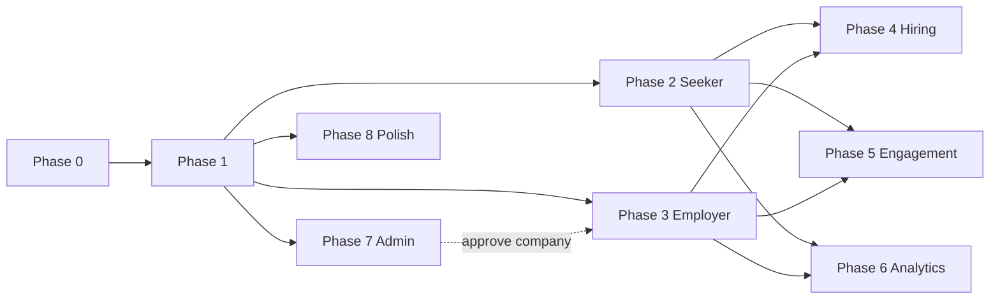

# Skytouch Frontend — Phased Delivery Plan

This document defines how to build the Skytouch frontend in phases, aligned with the existing Spring Boot REST API.

**API base (local):** `http://localhost:8083`  
**OpenAPI / Swagger:** `http://localhost:8083/swagger-ui.html`  
**Postman E2E reference:** `postman/Skytouch.postman_collection.json` (folders **01 → 04r**)

---

## Overview

| Phase | Name | Primary roles | Depends on |
|-------|------|---------------|------------|
| 0 | Foundation | All | — |
| 1 | Auth & account | All | 0 |
| 2 | Seeker core | JOB_SEEKER | 1 |
| 3 | Employer core | EMPLOYER | 1 |
| 4 | Hiring workflow | Seeker + Employer | 2, 3 |
| 5 | Engagement | Seeker (+ Employer notifications) | 2, 3 |
| 6 | Analytics & exports | Seeker + Employer | 2, 3 |
| 7 | Admin console | ADMIN | 1 |
| 8 | Account security & polish | All | 1 |

Phases **2, 3, and 7** can run in parallel after Phase 1. Phase **4** requires 2 + 3. Phase **7** (company approval) is required for full employer publish E2E when companies start as `PENDING`.



---

## Global conventions (all phases)

### Authentication

- **Register** → user is `PENDING` until email OTP verified.
- **Login** → `POST /api/auth/login` returns:
  ```json
  {
    "accessToken": "...",
    "tokenType": "Bearer",
    "expiresIn": 86400000,
    "userId": "uuid",
    "email": "...",
    "role": "JOB_SEEKER | EMPLOYER | ADMIN"
  }
  ```
- Send `Authorization: Bearer <accessToken>` on protected routes.
- **Logout:** `POST /api/auth/logout` → clear local session.
- On **401** → redirect to login. On **403** → show forbidden (wrong role).
- **Admin cannot self-register** — bootstrap only (`ADMIN_BOOTSTRAP_*` env vars).

### Pagination

List endpoints return `PageResponse`:

```json
{
  "content": [],
  "page": 0,
  "size": 20,
  "totalElements": 100,
  "totalPages": 5
}
```

Default query params: `page=0`, `size=20`.

### Errors

```json
{
  "status": 400,
  "error": "Bad Request",
  "message": "Human-readable message",
  "timestamp": "2026-..."
}
```

### Suggested route map

| Route | Access |
|-------|--------|
| `/` | Public landing |
| `/register`, `/verify-email`, `/login`, `/forgot-password`, `/reset-password` | Public |
| `/seeker/*` | JOB_SEEKER |
| `/employer/*` | EMPLOYER |
| `/admin/*` | ADMIN |
| `/settings/account` | Authenticated (all roles) |

Post-login redirect: seeker → `/seeker/dashboard`, employer → `/employer/dashboard`, admin → `/admin/dashboard`.

---

## Phase 0 — Foundation

**Goal:** App boots, talks to the API, has auth plumbing.

### Deliverables

- React + TypeScript + Vite (or Next.js), router, env config (`VITE_API_URL`)
- API client with Bearer interceptor
- Auth store: `accessToken`, `userId`, `email`, `role`
- Error handler → toasts from `{ status, message }`
- Reusable paginated list component
- Layout shells: public + role placeholders
- Route guards: `RequireAuth`, `RequireRole`

### Exit criteria

- App runs against local API on port 8083
- 401 clears session and redirects to `/login`

---

## Phase 1 — Auth & account

**Goal:** Register, verify email, login, password recovery, logout.

### Screens & APIs

| Screen | Method | Endpoint |
|--------|--------|----------|
| Register (seeker / employer) | POST | `/api/auth/register` |
| Verify email | POST | `/api/auth/verify-email/{email}` |
| Resend OTP | POST | `/api/auth/verify-email/resend` |
| Login | POST | `/api/auth/login` |
| Forgot password | POST | `/api/auth/forgot-password` |
| Reset password | POST | `/api/auth/reset-password` |
| Logout | POST | `/api/auth/logout` |

### Register body

```json
{
  "userType": "JOB_SEEKER",
  "email": "...",
  "password": "...",
  "confirmPassword": "...",
  "firstName": "...",
  "lastName": "...",
  "phone": "+2348012345678",
  "companyName": "Acme Ltd"
}
```

`userType`: `JOB_SEEKER` or `EMPLOYER`. `companyName` optional for employers at signup.

### UX notes

- Handle 409 (email exists), 401 (invalid OTP / wrong password)
- Block login if email unverified → link to verify flow
- Show message if account suspended

### Exit criteria

- Full auth loop: register → verify → login → logout

---

## Phase 2 — Seeker core

**Goal:** Profile, browse jobs, apply, track applications.

### Screens & APIs

| Screen | Method | Endpoint |
|--------|--------|----------|
| Profile | GET | `/api/job-seekers/me` |
| Dashboard | GET | `/api/job-seekers/me/dashboard` |
| Onboarding (CV) | PATCH | `/api/job-seekers/me/onboarding` (multipart) |
| KYC | PATCH | `/api/job-seekers/me/kyc` |
| Job search | GET | `/api/jobs?keyword&employmentType&workMode&state&industry&page&size` |
| Job detail | GET | `/api/jobs/{id}` |
| Apply | POST | `/api/jobs/{id}/applications` |
| My applications | GET | `/api/applications/me` |
| Application detail | GET | `/api/applications/me/{id}` |
| Withdraw | POST | `/api/applications/me/{id}/withdraw` |

### Gates

- **CV required** before apply — block apply button, link to onboarding
- Show status badges: `SUBMITTED`, `REVIEWING`, `SHORTLISTED`, `INTERVIEW_SCHEDULED`, `OFFER_EXTENDED`, `HIRED`, `REJECTED`, `WITHDRAWN`, `OFFER_DECLINED`

### Exit criteria

- Seeker: onboard CV → search job → apply → see application in list

---

## Phase 3 — Employer core

**Goal:** Company profile, jobs, applicant review.

### Screens & APIs

| Screen | Method | Endpoint |
|--------|--------|----------|
| Profile | GET / PATCH | `/api/employers/me`, `/api/employers/me/profile` |
| Dashboard | GET | `/api/employers/me/dashboard` |
| Create company | POST | `/api/companies` |
| My company | GET / PATCH | `/api/companies/me` |
| Create job | POST | `/api/jobs` |
| My jobs | GET | `/api/jobs/me` |
| Update job | PATCH | `/api/jobs/{id}` |
| Publish job | POST | `/api/jobs/{id}/publish` |
| Close job | POST | `/api/jobs/{id}/close` |
| Applicants | GET | `/api/jobs/{id}/applications` |
| Update application status | PATCH | `/api/jobs/{id}/applications/{applicationId}` |

### Company status gates

| Status | UX |
|--------|-----|
| `PENDING` | Banner: awaiting admin approval; **cannot publish** |
| `ACTIVE` | Full access |
| `REJECTED` | Read-only + contact support |

Publish error *"Company must be approved by an admin"* → link to company page.

### Exit criteria

- Employer creates company → (after admin approve) publishes job → updates applicant status

---

## Phase 4 — Hiring workflow

**Goal:** Messages, interviews, offers through to hire.

### Screens & APIs

| Feature | Method | Endpoint |
|---------|--------|----------|
| List messages | GET | `/api/applications/{applicationId}/messages` |
| Send message | POST | `/api/applications/{applicationId}/messages` |
| Mark messages read | POST | `/api/applications/{applicationId}/messages/read` |
| Schedule interview | POST | `/api/applications/{applicationId}/interviews` |
| List interviews (application) | GET | `/api/applications/{applicationId}/interviews` |
| Update interview | PATCH | `/api/interviews/{id}` |
| My interviews (seeker) | GET | `/api/interviews/me` |
| Extend offer | POST | `/api/applications/{applicationId}/offers` |
| List offers (application) | GET | `/api/applications/{applicationId}/offers` |
| My offers (seeker) | GET | `/api/offers/me` |
| Accept offer | POST | `/api/offers/{id}/accept` |
| Decline offer | POST | `/api/offers/{id}/decline` |

### UI

- Application detail tabs: **Overview | Messages | Interviews | Offers**
- Employer pipeline (Kanban or stepper) on `ApplicationStatus`

### Exit criteria

- Shortlist → interview → offer → accept → `HIRED`

---

## Phase 5 — Engagement

**Goal:** Notifications, saved jobs, job alerts.

### Screens & APIs

| Feature | Method | Endpoint |
|---------|--------|----------|
| Notifications | GET | `/api/notifications/me` |
| Unread count | GET | `/api/notifications/me/unread-count` |
| Mark read | PATCH | `/api/notifications/me/{id}/read` |
| Mark all read | POST | `/api/notifications/me/read-all` |
| Saved jobs list | GET | `/api/saved-jobs/me` |
| Save job | POST | `/api/saved-jobs/jobs/{jobId}` |
| Unsave job | DELETE | `/api/saved-jobs/jobs/{jobId}` |
| Create alert | POST | `/api/job-alerts` |
| My alerts | GET | `/api/job-alerts/me` |
| Update alert | PATCH | `/api/job-alerts/{id}` |
| Delete alert | DELETE | `/api/job-alerts/{id}` |

### Exit criteria

- Bell badge shows unread count; save job; create alert; notifications after status changes

---

## Phase 6 — Analytics & exports

**Goal:** Funnel analytics and CSV downloads.

### Screens & APIs

| Feature | Method | Endpoint |
|---------|--------|----------|
| Employer funnel | GET | `/api/employers/me/analytics` |
| Per-job analytics | GET | `/api/employers/me/analytics/jobs/{jobId}` |
| Export job applications | GET | `/api/jobs/{id}/applications/export` |
| Export company applications | GET | `/api/employers/me/applications/export` |
| Export my applications (seeker) | GET | `/api/applications/me/export` |

CSV responses use `Content-Type: text/csv` and `Content-Disposition: attachment` — trigger browser download.

### Exit criteria

- Funnel charts render; CSV downloads work

---

## Phase 7 — Admin console

**Goal:** Platform moderation, observability, ops.

Admin logs in via `/login` only (no register page).

### Screens & APIs

| Feature | Method | Endpoint |
|---------|--------|----------|
| Dashboard | GET | `/api/admin/dashboard` |
| Pending companies | GET | `/api/admin/companies/pending` |
| Approve company | PATCH | `/api/admin/companies/{id}/approve` |
| Reject company | PATCH | `/api/admin/companies/{id}/reject` |
| Suspend user | PATCH | `/api/admin/users/{id}/suspend` |
| Force-close job | PATCH | `/api/admin/jobs/{id}/close` |
| Platform analytics | GET | `/api/admin/analytics` |
| Audit log | GET | `/api/admin/audit-events` |
| CSV export | GET | `/api/admin/export/{users\|jobs\|applications\|companies}` |
| Run job alert digest | POST | `/api/admin/job-alerts/digest/run` |
| Expire stale offers | POST | `/api/admin/offers/expire-stale` |

### Dashboard fields

`totalUsers`, `jobSeekers`, `employers`, `admins`, `pendingEmailVerifications`, `pendingAccounts`, `pendingCompanies`, `activeJobs`, `totalApplications`, `totalHires`, `totalAuditEvents`

### Exit criteria

- Admin approves pending company → employer can publish jobs

---

## Phase 8 — Account security & polish

**Goal:** Password management, deactivation, production UX.

### Screens & APIs

| Feature | Method | Endpoint |
|---------|--------|----------|
| Change password | PATCH | `/api/auth/me/password` |
| Deactivate account | POST | `/api/auth/me/deactivate` |

Body for change password: `{ currentPassword, newPassword, confirmPassword }`  
Body for deactivate: `{ password }`

Both revoke all server sessions → **force re-login** after success.

### Polish

- Landing / marketing pages
- Empty states, loading skeletons, error boundaries
- Responsive layouts

### Exit criteria

- Password change and deactivate clear token and redirect to login

---

## Suggested sprint mapping

| Sprint | Phases |
|--------|--------|
| Sprint A | 0 + 1 |
| Sprint B | 2 + 3 (parallel) |
| Sprint C | 7 + 4 |
| Sprint D | 5 + 6 |
| Sprint E | 8 + E2E QA |

---

## E2E validation against backend

Run the Postman collection to validate backend behaviour while building each phase:

```powershell
newman run postman/Skytouch.postman_collection.json `
  -e postman/Skytouch-Local.postman_environment.json `
  --env-var "emailOtp=123456" `
  --env-var "employerEmailOtp=123456" `
  --env-var "rejectTestEmployerEmailOtp=123456"
```

Requires: API on `:8083`, `APP_LOG_OTP=true` or manual OTP values, admin credentials matching `adminEmail` / `adminPassword` in the Postman environment.

---

## One-line AI build prompt

> Build a React TypeScript SPA for Skytouch at `VITE_API_URL=http://localhost:8083` following `docs/frontend-phases.md`: public auth (register/verify/login/reset), role shells for seeker/employer/admin, Bearer sessions, paginated lists, multipart CV onboarding, employer company approval gate before publish, hiring pipeline (apply → interview → offer → hire), notifications, alerts, analytics, CSV exports, and admin moderation — contract from Swagger at `/swagger-ui.html`.
